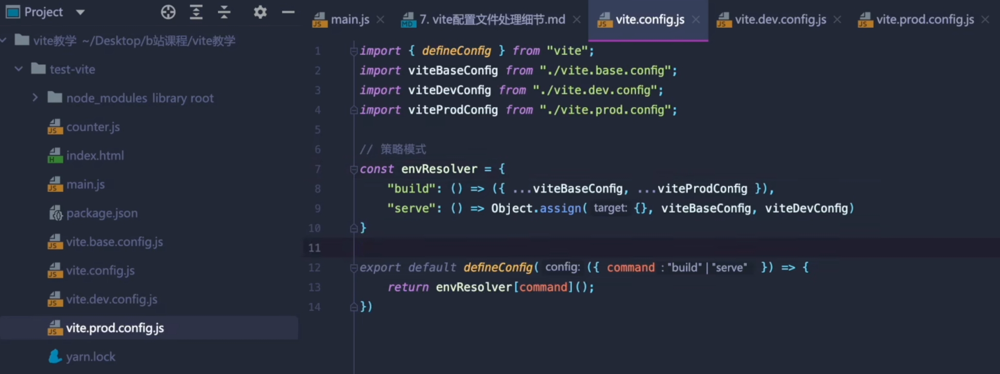

# vite 配置文件处理细节

1. vite配置文件vite.config.js的语法提示
   1. 如果你使用的是webstorm, 那你可以得到很好的语法补全
   2. 如果你使用是vscode或者其他的编辑器, 则需要做一些特殊处理
   
      ```js
      import { defineConfig } from 'vite'
      export default defineConfig({
         plugins: []
      })

      ```
      ```
      /** import("vite").UserConfig */
      const viteConfig = {
         plugins: []
      }
      export default viteConfig;
      ```
   
2. 关于环境的处理
   过去我们使用webpack的时候, 我们要区分配置文件的一个环境
   - webpack.dev.config
   - webpack.prod.config
   - webpack.base.config
   - webpackmerge
   
   vite中, 我们只需要一个配置文件, 并且通过环境变量区分
   