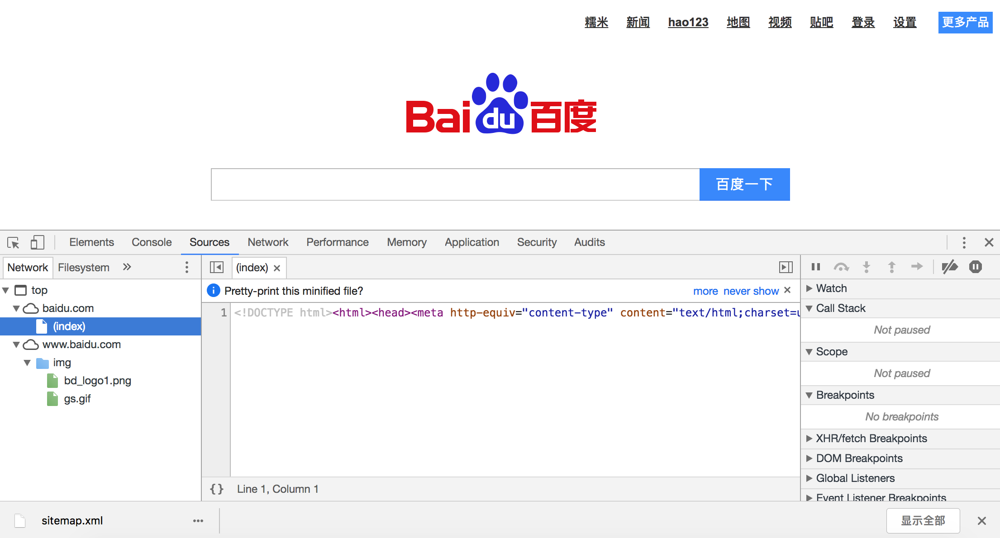
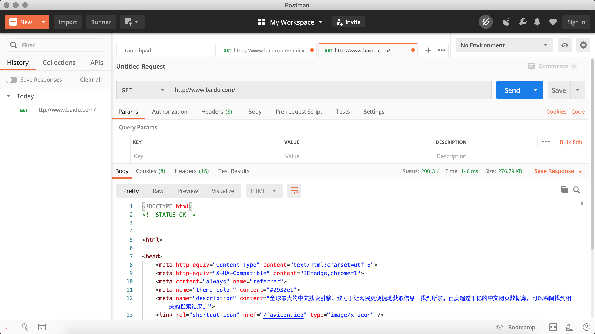
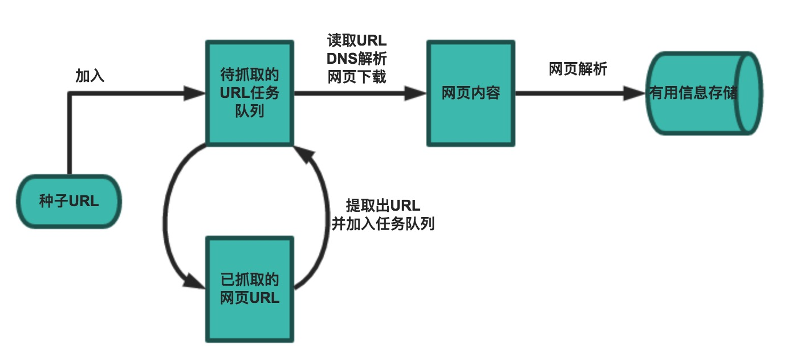

## 第31课：网络数据采集概述

爬虫（crawler）也经常被称为网络蜘蛛（spider），是按照一定的规则自动浏览网站并获取所需信息的机器人程序（自动化脚本代码），被广泛的应用于互联网搜索引擎和数据采集。使用过互联网和浏览器的人都知道，网页中除了供用户阅读的文字信息之外，还包含一些超链接，网络爬虫正是通过网页中的超链接信息，不断获得网络上其它页面的地址，然后持续的进行数据采集。正因如此，网络数据采集的过程就像一个爬虫或者蜘蛛在网络上漫游，所以才被形象的称为爬虫或者网络蜘蛛。

### 爬虫的应用领域

在理想的状态下，所有 ICP（Internet Content Provider）都应该为自己的网站提供 API 接口来共享它们允许其他程序获取的数据，在这种情况下就根本不需要爬虫程序。国内比较有名的电商平台（如淘宝、京东等）、社交平台（如微博、微信等）等都提供了自己的 API 接口，但是这类 API 接口通常会对可以抓取的数据以及抓取数据的频率进行限制。对于大多数的公司而言，及时的获取行业数据和竞对数据是企业生存的重要环节之一，然而对大部分企业来说，数据都是其与生俱来的短板。在这种情况下，合理的利用爬虫来获取数据并从中提取出有商业价值的信息对这些企业来说就显得至关重要的。

爬虫的应用领域其实非常广泛，下面我们列举了其中的一部分，有兴趣的读者可以自行探索相关内容。

1. 搜索引擎
2. 新闻聚合
3. 社交应用
4. 舆情监控
5. 行业数据

### 爬虫合法性探讨

经常听人说起“爬虫写得好，牢饭吃到饱”，那么编程爬虫程序是否违法呢？关于这个问题，我们可以从以下几个角度进行解读。

1. 网络爬虫这个领域目前还属于拓荒阶段，虽然互联网世界已经通过自己的游戏规则建立起了一定的道德规范，即 Robots 协议（全称是“网络爬虫排除标准”），但法律部分还在建立和完善中，也就是说，现在这个领域暂时还是灰色地带。
2. “法不禁止即为许可”，如果爬虫就像浏览器一样获取的是前端显示的数据（网页上的公开信息）而不是网站后台的私密敏感信息，就不太担心法律法规的约束，因为目前大数据产业链的发展速度远远超过了法律的完善程度。
3. 在爬取网站的时候，需要限制自己的爬虫遵守 Robots 协议，同时控制网络爬虫程序的抓取数据的速度；在使用数据的时候，必须要尊重网站的知识产权（从Web 2.0时代开始，虽然Web上的数据很多都是由用户提供的，但是网站平台是投入了运营成本的，当用户在注册和发布内容时，平台通常就已经获得了对数据的所有权、使用权和分发权）。如果违反了这些规定，在打官司的时候败诉几率相当高。
4. 适当的隐匿自己的身份在编写爬虫程序时必要的，而且最好不要被对方举证你的爬虫有破坏别人动产（例如服务器）的行为。
5. 不要在公网（如代码托管平台）上去开源或者展示你的爬虫代码，这些行为通常会给自己带来不必要的麻烦。

#### Robots协议

大多数网站都会定义`robots.txt`文件，这是一个君子协议，并不是所有爬虫都必须遵守的游戏规则。下面以淘宝的[`robots.txt`](http://www.taobao.com/robots.txt)文件为例，看看淘宝网对爬虫有哪些限制。

```
User-agent: Baiduspider
Disallow: /

User-agent: baiduspider
Disallow: /
```

通过上面的文件可以看出，淘宝禁止百度爬虫爬取它任何资源，因此当你在百度搜索“淘宝”的时候，搜索结果下方会出现：“由于该网站的`robots.txt`文件存在限制指令（限制搜索引擎抓取），系统无法提供该页面的内容描述”。百度作为一个搜索引擎，至少在表面上遵守了淘宝网的`robots.txt`协议，所以用户不能从百度上搜索到淘宝内部的产品信息。

图1. 百度搜索淘宝的结果


下面是豆瓣网的[`robots.txt`](https://www.douban.com/robots.txt)文件，大家可以自行解读，看看它做出了什么样的限制。

```
User-agent: *
Disallow: /subject_search
Disallow: /amazon_search
Disallow: /search
Disallow: /group/search
Disallow: /event/search
Disallow: /celebrities/search
Disallow: /location/drama/search
Disallow: /forum/
Disallow: /new_subject
Disallow: /service/iframe
Disallow: /j/
Disallow: /link2/
Disallow: /recommend/
Disallow: /doubanapp/card
Disallow: /update/topic/
Disallow: /share/
Allow: /ads.txt
Sitemap: https://www.douban.com/sitemap_index.xml
Sitemap: https://www.douban.com/sitemap_updated_index.xml
# Crawl-delay: 5

User-agent: Wandoujia Spider
Disallow: /

User-agent: Mediapartners-Google
Disallow: /subject_search
Disallow: /amazon_search
Disallow: /search
Disallow: /group/search
Disallow: /event/search
Disallow: /celebrities/search
Disallow: /location/drama/search
Disallow: /j/
```

### 超文本传输协议（HTTP）

在开始讲解爬虫之前，我们稍微对超文本传输协议（HTTP）做一些回顾，因为我们在网页上看到的内容通常是浏览器执行 HTML （超文本标记语言）得到的结果，而 HTTP 就是传输 HTML 数据的协议。HTTP 和其他很多应用级协议一样是构建在 TCP（传输控制协议）之上的，它利用了 TCP 提供的可靠的传输服务实现了 Web 应用中的数据交换。按照维基百科上的介绍，设计 HTTP 最初的目的是为了提供一种发布和接收 [HTML](https://zh.wikipedia.org/wiki/HTML) 页面的方法，也就是说，这个协议是浏览器和 Web 服务器之间传输的数据的载体。关于 HTTP 的详细信息以及目前的发展状况，大家可以阅读[《HTTP 协议入门》](http://www.ruanyifeng.com/blog/2016/08/http.html)、[《互联网协议入门》](http://www.ruanyifeng.com/blog/2012/05/internet_protocol_suite_part_i.html)、[《图解 HTTPS 协议》](http://www.ruanyifeng.com/blog/2014/09/illustration-ssl.html)等文章进行了解。

下图是我在四川省网络通信技术重点实验室工作期间用开源协议分析工具 Ethereal（WireShark 的前身）截取的访问百度首页时的 HTTP 请求和响应的报文（协议数据），由于 Ethereal 截取的是经过网络适配器的数据，因此可以清晰的看到从物理链路层到应用层的协议数据。

图2. HTTP请求


HTTP 请求通常是由请求行、请求头、空行、消息体四个部分构成，如果没有数据发给服务器，消息体就不是必须的部分。请求行中包含了请求方法（GET、POST 等，如下表所示）、资源路径和协议版本；请求头由若干键值对构成，包含了浏览器、编码方式、首选语言、缓存策略等信息；请求头的后面是空行和消息体。


图3. HTTP响应


HTTP 响应通常是由响应行、响应头、空行、消息体四个部分构成，其中消息体是服务响应的数据，可能是 HTML 页面，也有可能是JSON或二进制数据等。响应行中包含了协议版本和响应状态码，响应状态码有很多种，常见的如下表所示。


#### 相关工具

下面我们先介绍一些开发爬虫程序的辅助工具，这些工具相信能帮助你事半功倍。

1. Chrome Developer Tools：谷歌浏览器内置的开发者工具。该工具最常用的几个功能模块是：

   - 元素（ELements）：用于查看或修改 HTML 元素的属性、CSS 属性、监听事件等。CSS 可以即时修改，即时显示，大大方便了开发者调试页面。
   - 控制台（Console）：用于执行一次性代码，查看 JavaScript 对象，查看调试日志信息或异常信息。控制台其实就是一个执行 JavaScript 代码的交互式环境。
   - 源代码（Sources）：用于查看页面的 HTML 文件源代码、JavaScript 源代码、CSS 源代码，此外最重要的是可以调试 JavaScript 源代码，可以给代码添加断点和单步执行。
   - 网络（Network）：用于 HTTP 请求、HTTP 响应以及与网络连接相关的信息。
   - 应用（Application）：用于查看浏览器本地存储、后台任务等内容，本地存储主要包括Cookie、Local Storage、Session Storage等。

   

2. Postman：功能强大的网页调试与 RESTful 请求工具。Postman可以帮助我们模拟请求，非常方便的定制我们的请求以及查看服务器的响应。

   

3. HTTPie：命令行HTTP客户端。

   安装。

   ```Bash
   pip install httpie
   ```

   使用。

   ```Bash
   http --header http --header https://movie.douban.com/
   
   HTTP/1.1 200 OK
   Connection: keep-alive
   Content-Encoding: gzip
   Content-Type: text/html; charset=utf-8
   Date: Tue, 24 Aug 2021 16:48:00 GMT
   Keep-Alive: timeout=30
   Server: dae
   Set-Cookie: bid=58h4BdKC9lM; Expires=Wed, 24-Aug-22 16:48:00 GMT; Domain=.douban.com; Path=/
   Strict-Transport-Security: max-age=15552000
   Transfer-Encoding: chunked
   X-Content-Type-Options: nosniff
   X-DOUBAN-NEWBID: 58h4BdKC9lM
   ```

4. `builtwith`库：识别网站所用技术的工具。

   安装。

   ```Bash
   pip install builtwith
   ```

   使用。

   ```Python
   import ssl
   
   import builtwith
   
   ssl._create_default_https_context = ssl._create_unverified_context
   print(builtwith.parse('http://www.bootcss.com/'))
   ```

5. `python-whois`库：查询网站所有者的工具。

   安装。

   ```Bash
   pip3 install python-whois
   ```

   使用。

   ```Python
   import whois
   
   print(whois.whois('https://www.bootcss.com'))
   ```

### 爬虫的基本工作流程

一个基本的爬虫通常分为数据采集（网页下载）、数据处理（网页解析）和数据存储（将有用的信息持久化）三个部分的内容，当然更为高级的爬虫在数据采集和处理时会使用并发编程或分布式技术，这就需要有调度器（安排线程或进程执行对应的任务）、后台管理程序（监控爬虫的工作状态以及检查数据抓取的结果）等的参与。



一般来说，爬虫的工作流程包括以下几个步骤：

1. 设定抓取目标（种子页面/起始页面）并获取网页。
2. 当服务器无法访问时，按照指定的重试次数尝试重新下载页面。
3. 在需要的时候设置用户代理或隐藏真实IP，否则可能无法访问页面。
4. 对获取的页面进行必要的解码操作然后抓取出需要的信息。
5. 在获取的页面中通过某种方式（如正则表达式）抽取出页面中的链接信息。
6. 对链接进行进一步的处理（获取页面并重复上面的动作）。
7. 将有用的信息进行持久化以备后续的处理。
